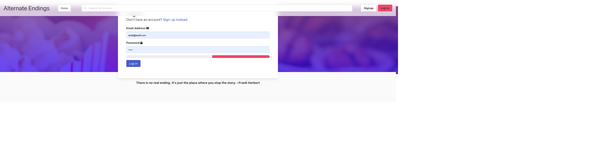
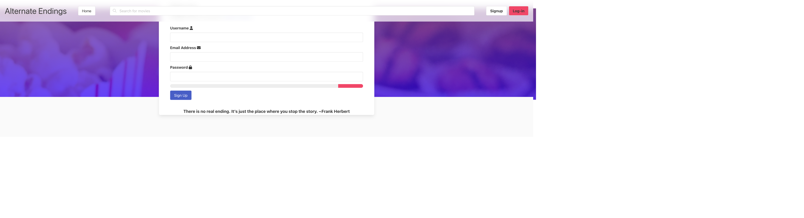
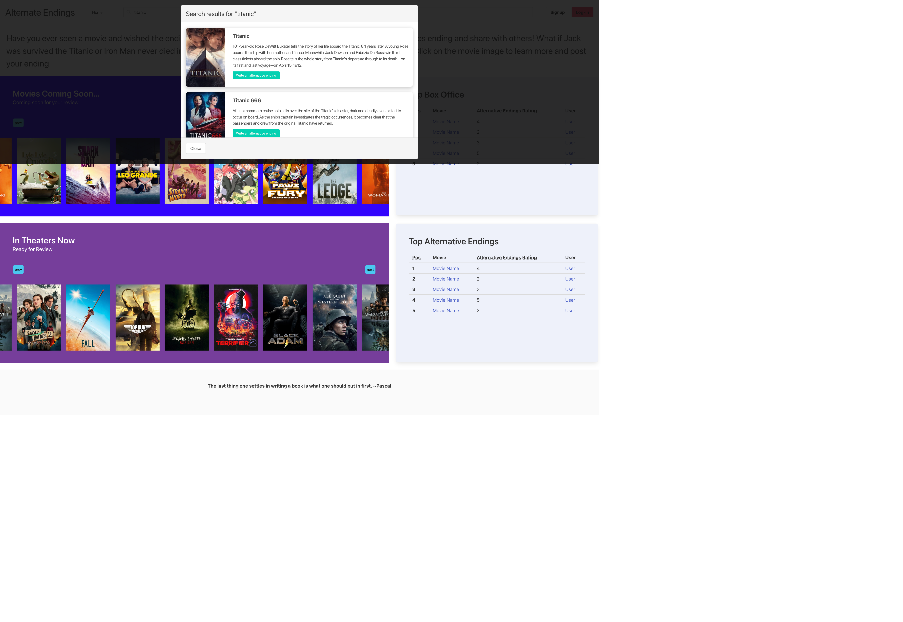

# Project 2 - Alternative Endings

## Purpose

Have you ever watched a movie that takes you on a captivating journey and keeps you invested throughout its duration only to leave you devastated because of its lackluster ending?

As a movie buff and creative write, I would like:

- I would like to know the upcoming and current movies in theaters.
- I would like to review movies and give them alternative endings!
- I want users to comment on my alternative ending and share their perspective.

## Requirements

- Use Node.js and Express.js to create RESTful API
- Use a template engine such as Handlebars.js
- Use MYSQL and the Sequelize ORM for the database
- Have both GET and POST routes for retrieving and adding new data
- Have a polished UI
- Be responsive
- Be interactive (ie. accepts and respond to user input)
- Must have a folder structure that meets MVC paradigm
- Must include authentication (cooties and express-sessions)
- Must protect API keys and sensitive information with environment variables
- Have a clean repository that meets quality coding standards (file structure, naming conventions, follows best practices for class/id naming conventions, indentation, quality comments, etc.)
- Have a quality README (with unique name, description, technologies used, screenshot, and links to deployed application)
- Include this project in our individual portfolios.

## Project Presentation

Made with ❤️ by: Teresa Hartsfield

https://www.beautiful.ai/player/-NFnbv3CVMnH8FyXqtZc

## Git Hub

https://github.com/ScarElite/Alternative-Endings

## Heroku Deployment

https://alternative-endings.herokuapp.com/

## Installations

- npm i node
- npm i express
- npm i dotenv
- npm i mysql
- npm i mysql2
- npm i sequelize
- npm i express-handlebars
- npm i handlebars
- npm i express-session
- npm i bootstrap
- npm i equalizer
- npm i nodemailer
- npm i bcrypt
- npm i connect-session-sequelize

## Contribution

Made with ❤️ by:

https://github.com/ScarElite

https://github.com/hartsfieldt

https://github.com/taholton748

https://github.com/ashleymullikin

## Front End

## Back End

